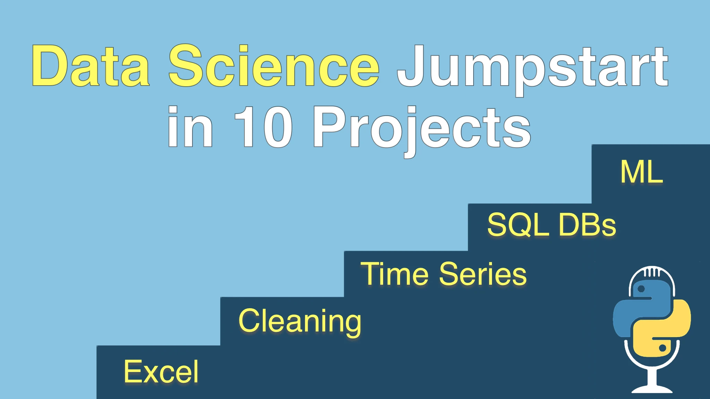

# Data Science Jumpstart with 10 Projects Course
[](https://training.talkpython.fm/courses/data-science-jumpstart-with-10-projects)


## Instructions

You can run the notebook using Github Codespaces or locally:

## Running in GitHub Codespaces

You can use GitHub Codespaces to run this codebase in a fully configured, cloud-hosted development environment:

1. Click the green "Code" button on the main repository page.

2. Click "Open with Codespaces" and "New codespace."

3. Open up a notebook in `notebooks` (e.g. `notebooks/01-StudentData.ipynb`)

## Running Locally
To run this codebase locally, you'll need to set up a Python virtual environment and install the necessary packages. Follow these steps:

1. Ensure you have Python installed on your system. If not, you can download it from [here](https://www.python.org/downloads/).

2. Clone this repository into your local machine using the terminal (macOS and Linux), Windows Terminal (Windows), or a GUI tool like [SourceTree](https://www.sourcetreeapp.com) or [GitHub Desktop](https://desktop.github.com).

3. Navigate to the repository folder via your terminal.

4. Create a virtual environment. You can do this by running:
    ```
    python -m venv env
    ```
    This will create a new Python virtual environment in a folder named `env`. Note: On some systems you'll need to type `python3` rather than `python`.

5. Activate the virtual environment. On macOS and Linux, run:
    ```
    source env/bin/activate
    ```
    On Windows, run:
    ```
    .\env\Scripts\activate
    ```

6. Install the necessary packages using pip by running:
    ```
    pip install -r requirements.txt
    ```
    This will install all the packages listed in `requirements.txt` to your virtual environment.

7. Launch jupyter
   ```
   jupyter lab
   ```
   
8.  Open up a notebook in `notebooks` (e.g. `notebooks/01-StudentData.ipynb`).
